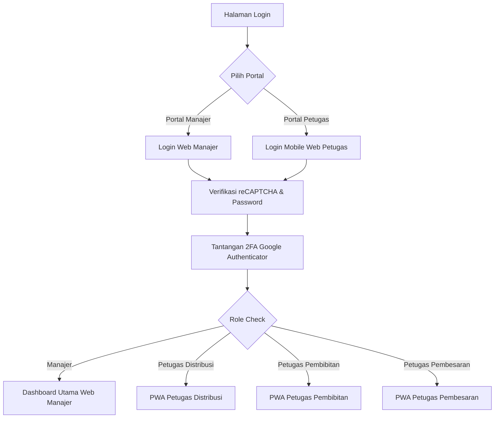

# Product Requirement Document (PRD)
# SIM-BUDIDAYA (Sistem Informasi Manajemen Budidaya Ikan)

---

## 1. Ringkasan Eksekutif (Executive Summary)
**SIM-BUDIDAYA** adalah platform manajemen budidaya dan distribusi perikanan terpadu yang dirancang untuk mengoptimalkan seluruh rantai operasional—mulai dari proses pembenihan (*hatchery/pembibitan*), pembesaran (*grow-out*), pengelolaan stok pakan, manajemen logistik armada distribusi, pemetaan geospatial mitra distributor, hingga rekapitulasi margin keuangan.

Sistem ini memiliki dua antarmuka utama:
1. **Portal Web Manajer (Desktop-First / Responsive):** Digunakan oleh manajer operasional untuk pengawasan analitik KPI, input master data, kontrol rantai pasok, persetujuan cuti, dan monitoring keuangan.
2. **Portal Mobile Web / PWA Petugas (Mobile-First / PWA):** Digunakan oleh petugas operasional lapangan (Distribusi, Pembibitan, dan Pembesaran) dengan antarmuka layar sentuh yang cepat, ringan, dan responsif.

---

## 2. Arsitektur & Keamanan Sistem (Security Architecture)

### 2.1 Lapisan Keamanan & Otentikasi
1. **Multi-Role Authentication & Access Control:**
   - Pembatasan rute dan otorisasi menggunakan `RoleMiddleware`.
   - Pemisahan akses berbasis role: `manajer`, `petugas_distribusi`, `pembibitan`, dan `pembesaran`.
2. **Two-Factor Authentication (2FA Wajib):**
   - Integrasi Time-based One-Time Password (TOTP) standar Google Authenticator via `Google2FA`.
   - Form input 6-digit OTP saat verifikasi keamanan (`/2fa/setup` & `/login/2fa`).
3. **Single Active Session (One-Session Policy):**
   - Menjamin bahwa satu akun pengguna hanya dapat aktif pada satu perangkat/browser dalam satu waktu (`AuthenticateSession`). Sesi di perangkat lain otomatis di-terminate.
4. **Proteksi Brute Force & Rate Limiting:**
   - Pembatasan percobaan login (maksimal 5 kali gagal dengan penalti waktu tunggu 60 detik via `RateLimiter`).
5. **Google reCAPTCHA v2:**
   - Mencegah *bot submission* dan serangan otomatis pada form login.
6. **Perlindungan Basis Data & Security Headers:**
   - Penanganan khusus query exception untuk mencegah kebocoran struktur SQL (`SecurityHeadersMiddleware` & Custom 500 error handlers).

---

## 3. Alur Pengguna & Fitur Menu Lengkap (User Journey & Feature Breakdown)

---

### 3.1 Alur Masuk (Authentication Flow)

| Menu / Rute | Pengguna | Fitur & Fungsionalitas |
|---|---|---|
| `/login` | Manajer | Form login web desktop: Input email/username, password, Google reCAPTCHA, Remember Me. Validasi hak akses khusus role `manajer`. |
| `/mobile-petugas/login` | Petugas | Form login mobile PWA: Pilihan tab role (`Distribusi`, `Pembesaran`, `Pembibitan`), input email/nomor telepon, dan password. |
| `/2fa/setup` | Semua User Baru | Verifikasi awal 2FA: Form input 6-digit kode OTP pertama kali untuk aktivasi keamanan akun. |
| `/login/2fa` | Semua User Aktif | Form tantangan OTP 2FA reguler setelah verifikasi kata sandi berhasil. |
| `/logout` | Semua User | Penghapusan sesi, token cookies, dan redirect aman ke login. |

---

### 3.2 Portal Web Manajer (Desktop Web)

#### 1. Dashboard Utama (`/dashboard`)
- **Ringkasan KPI Eksekutif:** Total stok ikan siap panen (kg/ekor), total bibit aktif, estimasi margin keuntungan bulan berjalan, sisa stok pakan, dan armada aktif.
- **Grafik Tren Produksi & Penjualan:** Visualisasi grafik bulanan perbandingan biaya pakan vs pendapatan penjualan.
- **Alert & Status Kritis:** Notifikasi batch yang mendekati estimasi panen, stok pakan di bawah ambang batas minimum, dan pengajuan cuti yang tertunda.

#### 2. Manajemen Pembibitan (`/pembibitan`)
- **Tracking Batch Hatchery:** Monitoring siklus pembenihan mulai dari persiapan indukan, pemijahan, penetasan telur, hingga sortir ukuran benih.
- **Form Input Batch Bibit Baru:** Input jenis bibit ikan (Nila, Lele, Gurame, Patin), kolam hatchery, jumlah telur/larva, dan estimasi waktu panen bibit.
- **Update & Panen Benih:** Konversi benih siap tebar untuk dipindahkan ke kolam pembesaran atau dijual ke mitra.

#### 3. Manajemen Pembesaran (`/pembesaran`)
- **Siklus Budidaya Kolam:** Pengawasan siklus hidup harian (*Day of Culture / DOC*), estimasi biomassa kolam, rata-rata bobot ikan (*Average Body Weight / ABW*).
- **Kalkulasi FCR (Feed Conversion Ratio):** Perhitungan otomatis efisiensi pakan terhadap pertumbuhan bobot ikan.
- **Jadwal & Pencatatan Panen:** Input data panen raya atau panen parsial, berat total panen (kg), dan pencatatan kematian ikan (*mortality rate*).

#### 4. Monitoring Kolam & Pembudidaya (`/pembudidaya`)
- **Manajemen Kolam Budidaya:** Data inventaris seluruh kolam (Kolam Terpal, Kolam Beton, Kolam Tanah, Bioflok).
- **Status Operasional Kolam:** Indikator visual kolam aktif, masa persiapan/pengeringan, masa sterilisasi air, dan masa panen.
- **Parameter Kualitas Air:** Pencatatan suhu air, kadar pH, dan tingkat oksigen terlarut (DO).

#### 5. Log Stok & Manajemen Pakan (`/log-pakan`)
- **Inventori Pakan Terpusat:** Monitoring stok karung/kg pakan berdasarkan kode dan merk pelet pakan.
- **Riwayat Pengeluaran Pakan:** Catatan akumulasi pakan yang didistribusikan ke masing-masing sektor kolam harian.
- **Restok & Pembelian Pakan:** Pencatatan pengadaan pakan masuk dari supplier beserta harga beli.

#### 6. Distribusi & Pesanan Logistik (`/distribusi`)
- **Peta Geospatial Distribusi (Leaflet.js):** Peta digital interaktif yang menampilkan titik koordinat lokasi mitra distributor toko/pasar.
- **Manajemen Surat Jalan & Dispatch:** Pembuatan tiket pengiriman, alokasi armada/petugas kurir, status pengiriman (*Pending*, *Dalam Perjalanan*, *Terkirim*).
- **Rute Pengiriman:** Optimasi rute pengiriman logistik berdasarkan lokasi geografis mitra.

#### 7. Rekap Keuangan & Margin (`/keuangan`)
- **Arus Kas Masuk (Inflow):** Pencatatan omzet hasil penjualan ikan panen dan penjualan benih ke mitra.
- **Arus Kas Keluar (Outflow):** Rekapitulasi biaya belanja pakan, operasional kolam, bahan kimia/vitamin, dan biaya logistik armada.
- **Laba Kotor & Laba Bersih:** Perhitungan otomatis margin keuntungan bersih secara harian, bulanan, dan tahunan.

#### 8. Manajemen Mitra Distributor (`/mitra`)
- **Master Data Mitra:** Pengelolaan database mitra pedagang, restoran, eksportir, dan agen distributor.
- **Alamat & Koordinat Geografis:** Input titik latitude/longitude untuk pemetaan rute pada GIS map.
- **Riwayat Transaksi Mitra:** Total volume order (kg) dan histori pembayaran.

#### 9. Manajemen Petugas & SDM (`/petugas`)
- **Kelola Akun Karyawan:** Tambah, edit, aktivasi, atau nonaktifkan akun teknisi dan kurir.
- **Approval Pengajuan Libur/Cuti (`/petugas/libur/approval`):** Tinjauan dan persetujuan/penolakan cuti atau izin sakit dari petugas lapangan.
- **Form Pengajuan Cuti (`/petugas/libur/ajukan`):** Penginputan jadwal libur shift petugas operasional.

---

### 3.3 Portal Mobile Web / PWA Petugas (Mobile Experience)

---

#### A. Petugas Distribusi (Logistik & Kurir)
- **Splash Screen (`/mobile-petugas/splash`):** Layar pembuka branding transisi mulus.
- **Menu Pengiriman Aktif (`/mobile-petugas/pengiriman`):**
  - Daftar tugas pengantaran ikan hari ini.
  - Kartu ringkasan nama mitra, alamat tujuan, jenis komoditas ikan, dan bobot pesanan (kg).
- **Detail & Aksi Pengiriman (`/mobile-petugas/detail/{id}`):**
  - Penunjuk navigasi rute ke lokasi mitra.
  - Tombol aksi *"Selesaikan Pengiriman"* dan upload bukti tanda terima barang.
- **Menu Riwayat (`/mobile-petugas/riwayat`):**
  - Arsip seluruh pengiriman yang telah diselesaikan beserta timestamp.
- **Menu Akun (`/mobile-petugas/akun`):**
  - Informasi profil kurir, nomor kontak, panduan 2FA, dan tombol logout.

---

#### B. Petugas Pembibitan (Hatchery / Benih)
- **Dashboard Pembibitan (`/petugas-pembibitan`):**
  - Monitoring total batch benih yang sedang dalam perawatan.
  - Indikator kesiapan benih untuk dipanen/ditebar.
- **Form Input Batch (`/petugas-pembibitan/form`):**
  - Pencatatan pemijahan baru: Tanggal indukan, jenis ikan, jumlah butir telur.
  - Pencatatan mortalitas larva dan estimasi benih hidup.
- **Log Pakan Benih (`/petugas-pembibitan/log-pakan`):**
  - Form pencatatan pemberian pakan cacing sutra/pelet mikro harian.
- **Akun Petugas (`/petugas-pembibitan/akun`):**
  - Profil teknisi pembibitan dan pengaturan akun.

---

#### C. Petugas Pembesaran (Teknisi Kolam Pembesaran)
- **Dashboard Kolam Pembesaran (`/petugas-pembesaran`):**
  - Ringkasan kondisi seluruh kolam pembesaran yang sedang berjalan.
  - Indikator usia tebar (DOC) dan jadwal pemberian pakan.
- **Buat Batch Tebar Benih (`/petugas-pembesaran/create-batch`):**
  - Form input penaburan bibit ke kolam pembesaran (nomor kolam, jumlah ekor bibit, rata-rata ukuran tebar).
- **Log Pakan & Sampling Harian (`/petugas-pembesaran/log-pakan`):**
  - Input jumlah kilogram pakan harian (pagi/sore).
  - Input hasil sampling berat rata-rata ikan untuk memantau laju pertumbuhan.
- **Akun Petugas (`/petugas-pembesaran/akun`):**
  - Profil teknisi pembesaran dan pengaturan akun.

---

## 4. Spesifikasi Teknologi (Technology Stack)

| Komponen | Teknologi yang Digunakan |
|---|---|
| **Backend Framework** | Laravel 13.x (PHP 8.3+) |
| **Database** | MySQL / MariaDB |
| **Frontend Web** | Blade Templating, Tailwind CSS, Alpine.js |
| **Peta & Geospatial** | Leaflet.js, OpenStreetMap API |
| **Keamanan & 2FA** | Pragmarx/Google2FA, BaconQrCode, Google reCAPTCHA v2 |
| **Desain Mobile** | Responsive Mobile Layout + PWA Ready (*Service Worker & Web Manifest*) |
| **Build Tooling** | Vite, PostCSS, NPM |

---

## 5. Non-Functional Requirements (NFR)

1. **Responsivitas & Kompatibilitas:**
   - Portal Manajer dioptimalkan untuk resolusi desktop/laptop (1024px ke atas) dengan tata letak dashboard yang informatif.
   - Portal Petugas dioptimalkan untuk perangkat seluler (360px – 480px) serta dapat digunakan secara nyaman di tablet dan layar PC.
2. **Kinerja (Performance):**
   - Kecepatan muat halaman di bawah 1.5 detik pada koneksi internet standar (3G/4G/Wi-Fi).
   - Optimasi aset CSS/JS termonifikasi via Vite.
3. **Integritas Data:**
   - Transaksi keuangan dan pencatatan pakan menggunakan validasi ketat di sisi server untuk mencegah inkonsistensi stok atau nilai negatif.
   site key:0x4AAAAAAEdjd7gXP6zJ1anD
   secret:0x4AAAAAAEdjd1rePL43TdlZq4Pog4wNKQU

