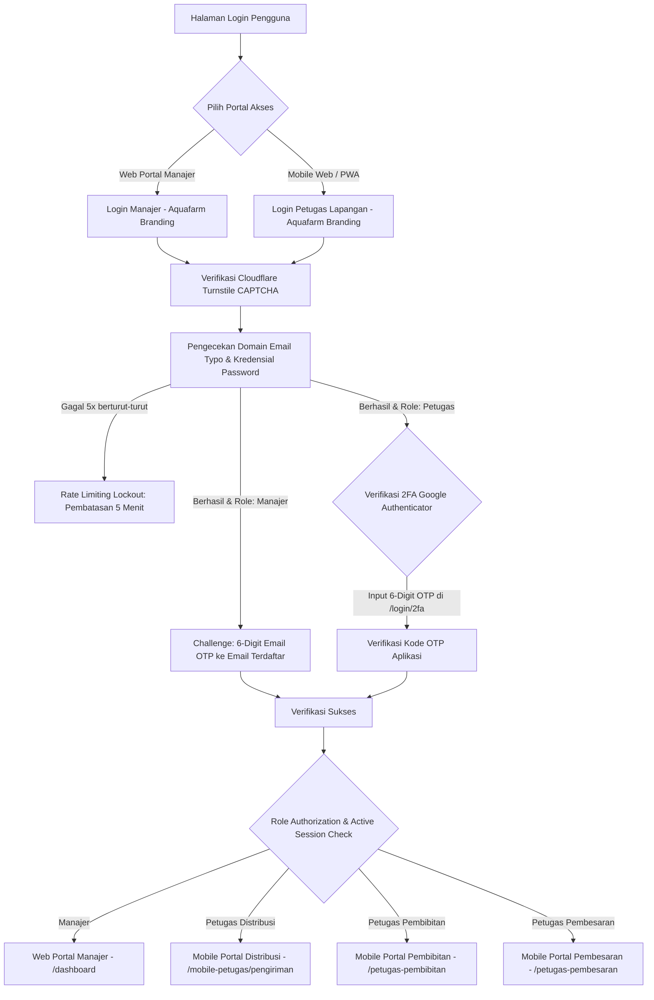

# Product Requirement Document (PRD)
# AMS BUDIDAYA (Aquafarm Management System Budidaya)
### *Aquafarm Aquaculture Management & Smart Supply Chain System*

---

## 1. Ringkasan Eksekutif (Executive Summary)
**AMS BUDIDAYA** (*Aquafarm Management System Budidaya*) adalah platform manajemen budidaya dan rantai pasok perikanan terpadu yang dirancang untuk mengotomatisasi, mengawasi, dan mengoptimalkan seluruh rantai operasional akuakultur—mulai dari proses pembenihan (*hatchery/pembibitan*) berbasis SOP spesies dinamis, pembesaran (*grow-out*), tata kelola inventori & restok pakan, logistik armada distribusi pesanan berbasis geospatial dengan multi-kolam & buffer allocation, rekapitulasi margin laba rugi keuangan, hingga manajemen akun serta keamanan multi-role pengguna.

Sistem ini mengadopsi identitas merek resmi **Aquafarm** (`Logo aquafarm.png`) dan beroperasi dengan arsitektur dual-portal:
1. **Portal Web Manajer (Desktop-First / Responsive):** Digunakan oleh manajer operasional untuk pengawasan analitik KPI tambak, konfigurasi master data (ikan, kolam, mitra, pakan), kontrol rantai pasok & distribusi terintegrasi, manajemen akun & pengelolaan Google Authenticator (2FA) petugas, pembukuan kas otomatis, serta ekspor laporan ke Excel.
2. **Portal Mobile Web / PWA Petugas (Mobile-First / PWA-Ready):** Digunakan oleh petugas lapangan (*Petugas Distribusi*, *Petugas Pembibitan*, dan *Petugas Pembesaran*) dengan antarmuka layar sentuh responsif, cepat, dan ringan untuk pencatatan aktivitas kolam harian, log pakan, monitoring fase SOP bibit, dan penyelesaian surat jalan distribusi langsung dari perangkat genggam (*smartphone*).

---

## 2. Identitas Merek & Desain Antarmuka (Brand Identity & Visual Assets)

| Komponen Aset | Implementasi & File Path | Penempatan Antarmuka |
|---|---|---|
| **Logo Resmi Perusahaan** | `public/build/images/Logo aquafarm.png` | Sidebar Desktop Manajer, Header Login Web Manajer, Splash Screen Mobile Petugas, Header Login Mobile Petugas, Formulir Lupa Password / Reset OTP, Email Notifikasi HTML OTP. |
| **Ilustrasi Login Portal** | `public/build/images/login ilustration.png` | Banner grafis visual sisi kanan pada desktop login manajer. |
| **Ikon Logistik & Distribusi** | `public/build/images/icon distribusi.png` & `icon siap kirim.png` | Modul distribusi pesanan, status surat jalan, dan mobile card pengiriman kurir. |
| **Logo Faktur & Invoice** | `public/build/images/logo sample di invoice.png` | Header bukti cetak invoice pesanan mitra distributor. |
| **Palet Warna Brand** | Primary Deep Navy (`#031B4E`, `#051B44`, `#0B2570`), Sky Blue Accent (`#0284C7`, `#38BDF8`), Emerald Accent (`#10B981`), Soft Gray Background (`#F4F6F9`) | Keseluruhan antarmuka web portal & mobile PWA. |

---

## 3. Arsitektur Keamanan & Otentikasi (Security Architecture)

Sistem menerapkan prinsip *defense-in-depth* dengan perlindungan multi-lapis:

### 3.1 Lapisan Keamanan Inti
1. **Multi-Role Role-Based Access Control (RBAC):**
   - Dilindungi melalui `RoleMiddleware` dan enkapsulasi otorisasi rute.
   - Pemisahan 4 hak akses peran: `manajer`, `petugas_distribusi`, `pembibitan`, dan `pembesaran`.
2. **Dual-Strategy Two-Factor Authentication (2FA):**
   - **Role Manajer (Email OTP):** Kode OTP acak 6-digit dikirimkan langsung ke email manajer (`SendOtpMail`) dengan masa kedaluwarsa 5 menit, fitur kirim ulang berkala (*resend cooldown*), dan proteksi brute force.
   - **Role Petugas (Google Authenticator TOTP Terkelola):**
     - **Setup & Tampilan Kunci:** QR Code dan manual *Secret Key* disediakan di profil/manajemen akun petugas (portal manajer & akun mobile). Petugas mendaftarkannya ke aplikasi Google Authenticator sekali saat akun dibuat/diterima.
     - **Verifikasi Bersih (`/login/2fa`):** Form login OTP hanya meminta 6 digit angka dari aplikasi tanpa menampilkan kembali QR code/secret key publik di layar login demi keamanan dan kecepatan akses.
     - **Regenerasi & Reset Kunci (`/petugas/{id}/regenerate-2fa`):** Manajer memiliki fitur darurat untuk mereset/membuat ulang kunci 2FA jika perangkat petugas hilang atau rusak.
3. **Lupa Kata Sandi Terpadu (Forgot Password via Email OTP):**
   - Rute pemulihan kata sandi mandiri (`/forgot-password`) untuk semua role dengan alur verifikasi kode 6-digit OTP email dan token sesi aman bertema Aquafarm.
4. **Proteksi Bot dengan Cloudflare Turnstile CAPTCHA:**
   - Perlindungan anti-bot modern tanpa friksi interupsi pengguna pada seluruh form login (Site Key: `0x4AAAAAAEdjd7gXP6zJ1anD`).
5. **Pendeteksi Anomali & Typo Email (`EmailSecurityService`):**
   - Pengecekan otomatis salah ketik domain email populer (misal: `gmai.com`, `yaho.com`, `hotmial.com`), filter email sekali pakai (*disposable email*), dan validasi sintaks ketat RFC.
6. **Proteksi Brute-Force & Rate Limiting:**
   - Pembatasan maksimal 5 kali kegagalan input kredensial/CAPTCHA dengan sanksi penguncian akun selama 300 detik (5 menit) disertai *countdown timer* interaktif.
7. **Single Active Session (One-Session Policy):**
   - Menjamin integritas operasional di mana satu akun hanya dapat login aktif pada satu browser/perangkat dalam satu waktu.
8. **Pengelolaan Profil & Avatar Pengguna (`foto_profil`):**
   - Unggah foto profil pengguna ke *storage* dengan validasi tipe berkas dan ukuran (maks 2MB), penghapusan foto usang otomatis, dan fallback avatar dinamis.

---

## 4. Matriks Menu & Logika Fungsional (Feature Breakdown & Business Rules)

### 4.1 Alur Autentikasi & Keamanan (Auth Routes)

| Rute / Endpoint | Aktor | Deskripsi Fungsionalitas & Branding |
|---|---|---|
| `/login` | Manajer | Form login web desktop berlogo Aquafarm: input Email/Username, Kata Sandi, Cloudflare Turnstile CAPTCHA, Remember Me. |
| `/login/otp` | Manajer | Form input 6-digit Email OTP yang dikirim ke email manajer saat login berhasil. |
| `/mobile-petugas/login` | Petugas Lapangan | Form login mobile PWA berlogo Aquafarm: pemilih tab role (`Distribusi`, `Pembesaran`, `Pembibitan`), input Email/No HP, Kata Sandi, dan Turnstile CAPTCHA. |
| `/login/2fa` | Petugas Lapangan | Form verifikasi 6-digit TOTP Google Authenticator setelah lolos validasi password. |
| `/petugas/{id}/regenerate-2fa` | Manajer | Endpoint regenerasi secret key & QR Code 2FA untuk akun petugas tertentu. |
| `/forgot-password` | Semua Role | Permintaan link/kode reset password via email terdaftar dengan logo Aquafarm. |
| `/forgot-password/verify` | Semua Role | Verifikasi kode OTP 6-digit pemulihan kata sandi. |
| `/forgot-password/reset` | Semua Role | Form penetapan kata sandi baru. |
| `/logout` & `/mobile-petugas/logout` | Semua Role | Terminasi sesi, pembersihan token autentikasi, dan pengalihan ke halaman masuk. |

---

### 4.2 Portal Web Manajer (Desktop-First / Responsive Web)

#### 1. Dashboard Eksekutif (`/dashboard`)
- **Header & Sidebar Branding:** Integrasi logo Aquafarm dan penamaan *AMS BUDIDAYA Aquafarm Management*.
- **Kartu Metrik KPI Real-Time:** Total biomassa ikan siap panen (kg), rata-rata FCR tambak, target panen berjalan (kg), total konsumsi pakan, rata-rata kualitas pH air, dan status batch aktif.
- **Grafik Finansial & Produksi Terintegrasi:** Visualisasi grafik bulanan perbandingan arus kas pemasukan vs pengeluaran dan tren pertumbuhan biomassa kolam.
- **Tabel Monitoring Batch Berjalan:** Ringkasan status kolam, jenis komoditas, usia tebar (DOC), dan estimasi berat.
- **Ekspor Laporan ke Excel (`/dashboard/export-excel`):** Unduh rekapitulasi data operasional tambak dan KPI secara instan dalam format `.xlsx`.

#### 2. Manajemen Batch Pembibitan & Sinkronisasi SOP Pertumbuhan (`/pembibitan`)
- **Pencatatan Siklus Hatchery:** Input kode batch, pemilihan kolam penetasan, jenis ikan (relasi ke master `ikan`), tanggal mulai pemijahan, jumlah telur/larva, dan catatan teknis.
- **Sinkronisasi Fase Pertumbuhan Dinamis Berbasis Spesies:**
  Sistem secara dinamis menghitung fase pertumbuhan dan status batch berdasarkan SOP spesifik jenis ikan (`durasi_penetasan` dan `durasi_pembibitan`):
  
  $$\text{DOC}_{\text{pemijahan}} = \text{Tanggal Hari Ini} - \text{Tanggal Pemijahan}$$
  
  - **Fase TELUR (`inkubasi`):** $\text{DOC} \le \text{durasi\_penetasan}$ hari.
  - **Fase LARVA (`menetas` / `aktif`):** $(\text{durasi\_penetasan} + 1) \le \text{DOC} \le (\text{durasi\_penetasan} + \text{round}(0.5 \times \text{durasi\_pembibitan}))$ hari.
  - **Fase FINGERLING (`aktif`):** $\text{DOC} > \text{akhir fase larva}$ dan $\text{DOC} < (\text{durasi\_penetasan} + \text{durasi\_pembibitan})$.
  - **Fase SIAP PINDAH (`siap_pindah`):** $\text{DOC} \ge (\text{durasi\_penetasan} + \text{durasi\_pembibitan})$.
- **Monitoring Mortalitas & Survival Rate (SR):** Kalkulasi kelangsungan hidup larva benih.
- **Fitur Transfer Benih ke Kolam Pembesaran (`/pembibitan/{id}/transfer`):** Mengonversi benih siap tebar langsung menjadi batch pembesaran baru di kolam tujuan serta memperbarui status batch pembibitan menjadi selesai/panen.

#### 3. Master Data Jenis Ikan (`/ikan`)
- **Katalog Spesies Budidaya:** Manajemen komoditas ikan (Nila Merah, Nila Hitam, Lele Sangkuriang, Gurame Soang, Patin Siam, dsb.).
- **Konfigurasi Standar Parameter SOP:** Konfigurasi durasi hari penetasan telur (`durasi_penetasan`) dan durasi pembibitan benih (`durasi_pembibitan`) sebagai acuan otomatis seluruh batch pembibitan.
- **Pemetaan Relasi Batch:** Menampilkan daftar batch pembibitan & pembesaran yang sedang aktif memanfaatkan jenis ikan tersebut.

#### 4. Manajemen Batch Pembesaran (`/pembesaran`)
- **Pelacakan Siklus Pembesaran (Grow-out):** Input batch kolam, tanggal tebar bibit, jumlah tebar (ekor), berat awal per ekor (gram), estimasi biomassa total (kg), dan target panen.
- **Kalkulasi Metrik Otomatis:** Perhitungan otomatis *Day of Culture (DOC)* harian, rata-rata bobot ikan (*Average Body Weight / ABW*), estimasi biomassa kolam, dan rasio konversi pakan (*Feed Conversion Ratio / FCR*).
- **Manajemen Panen:** Pencatatan panen parsial, panen total/kuras, jumlah berat riil panen (kg), tanggal panen aktual, dan mutasi sisa biomassa.

#### 5. Monitoring Kolam & Pembudidaya (`/pembudidaya`)
- **Inventaris Master Kolam:** Data seluruh kolam budidaya mencakup nama/kode kolam, tipe konstruksi (Kolam Terpal, Kolam Beton, Kolam Tanah, Sistem Bioflok), dimensi panjang x lebar x tinggi, volume air (m³), dan lokasi/blok tambak Aquafarm.
- **Status Operasional Kolam:** Indikator visual ketersediaan kolam (*Tersedia/Kosong, Terisi/Aktif, Masa Pengeringan/Persiapan, Masa Sterilisasi/Perawatan*).
- **Monitoring Parameter Kualitas Air:** Log pemantauan suhu (°C), derajat keasaman (pH), dan oksigen terlarut (*Dissolved Oxygen / DO*).

#### 6. Log Stok & Manajemen Pakan Terpadu (`/log-pakan`)
- **Inventori Master Stok Pakan (`StokPakan`):**
  - Katalog varian pakan (kode pakan, merk/nama pelet, tipe pakan: Pelet Apung, Pelet Tenggelam, Pakan Alami/Cacing Sutra, Tepung Mikro).
  - Peruntukan fase (*Pembibitan*, *Pembesaran*, *Semua*), satuan (kg/karung), batas minimum stok (*threshold*), dan harga satuan.
  - **Analisis Burn Rate & Proyeksi Sisa Hari:** Algoritma konsumsi 7 hari terakhir untuk menentukan proyeksi sisa hari stok habis dengan indikator status otomatis (*Kritis - Segera Restock*, *Waspada - Perlu Pesan*, *Aman*).
- **Pengadaan & Restok Pakan Supplier (`PembelianPakan`):**
  - Form input pembelian pakan masuk dari supplier.
  - **Otomatisasi Lintas Modul:** Penambahan saldo stok pakan secara otomatis sekaligus pencatatan otomatis transaksi pengeluaran di buku kas Keuangan.
  - **Pemesanan Cepat via WhatsApp:** Integrasi tombol order ke kontak WhatsApp supplier terpilih dengan draft pesan pesanan otomatis.
- **Log Konsumsi Pakan Harian Kolam (`ManajemenPakan`):**
  - Pencatatan pemberian pakan harian (pagi/sore) per kolam/batch dengan pengurangan saldo stok pakan secara *real-time*.

#### 7. Distribusi Logistik, Multi-Kolam & Alokasi Buffer (`/distribusi`)
- **Manajemen Surat Jalan & Tiket Pengiriman:** Pembuatan order penjualan ikan (nomor DO `#ORD-YYYY-XXXX`, mitra pemesan, kolam/batch asal, total kg, harga total, tanggal pengiriman, kurir, armada, dan status order: *Pending, Pemberokian/Proses, Dalam Pengiriman, Selesai, Dibatalkan*).
- **Aturan Alokasi Defisit & Kuras Kolam (Business Rules):**
  1. **Strict Same-Species Matching:** Pengambilan ikan untuk memenuhi suatu order harus berasal dari batch kolam siap panen dengan jenis ikan yang persis sama (`id_ikan` identik).
  2. **Alokasi Defisit Multi-Kolam:** Jika kolam utama tidak mencukupi kuota pesanan mitra, sistem mengambil kekurangan (defisit kg) dari kolam lain yang siap panen dari spesies yang sama.
  3. **Pemberokian & Kuras Kolam (Buffer Handling):** Ketika order memasuki tahap pemberokian/proses dari kolam kuras, sisa kg ikan yang tidak terpakai dapat dipindahkan ke kolam buffer/penampungan aktif lain dari spesies yang sama, sedangkan kolam asal yang telah habis biomassanya diubah statusnya menjadi `kosong`.
- **Peta Geospatial Interaktif Distribusi (Leaflet.js + OpenStreetMap):**
  - Peta digital GIS interaktif menampilkan sebaran titik koordinat (*latitude/longitude*) seluruh mitra distributor toko/pasar.
  - *Pin marker* interaktif dengan pop-up rute pengiriman, status pesanan aktif, dan informasi kontak mitra.

#### 8. Rekapitulasi & Laporan Keuangan (`/keuangan` & `/keuangan/transaksi`)
- **Buku Kas Arus Kas Masuk & Keluar:** Pencatatan omzet penjualan ikan/bibit (Inflow) dan biaya operasional belanja pakan, bibit, vitamin, listrik, BBM armada, serta perawatan kolam (Outflow).
- **Penomoran Referensi Transaksi Otomatis (SOP ID):** Format standar akuntansi unik berbasis tanggal (`TRX-YYMM-XXX`).
- **Skor Kesehatan Keuangan (Financial Health Score):** Metrik kalkulasi rasio margin keuntungan bersih terhadap beban operasional dengan status kesehatan kas (*Stable & Sehat* vs *Perlu Evaluasi*).
- **Analisis Laba Bersih & Arus Kas Bulanan:** Ringkasan total pendapatan, total beban, laba bersih, dan grafik tren arus kas per bulan sepanjang tahun berjalan.

#### 9. Manajemen Mitra Distributor & Supplier (`/mitra`)
- **Database Mitra Komprehensif:** Pengelolaan profil pembeli (Pasar Tradisional, Restoran/Hotel, Agen Grosir, Eksportir) serta Supplier Pakan/Bahan Baku.
- **Integrasi Koordinat Geografis GIS:** Input titik koordinat Latitude dan Longitude dengan bantuan visual peta untuk penentuan rute kurir.
- **Histori Transaksi Mitra:** Arsip volume order (kg), riwayat pengiriman, dan kontak telepon/WhatsApp langsung.

#### 10. Manajemen Akun Petugas & Tampilan 2FA (`/petugas`)
- **Kelola Data Karyawan:** Tambah akun petugas baru, perbarui identitas/nomor telepon, aktivasi/nonaktifkan akun, dan pemilihan role teknis (*Petugas Distribusi*, *Petugas Pembibitan*, *Petugas Pembesaran*).
- **Setup & Visualisasi Google Authenticator (2FA):**
  - **Form Edit Petugas & Modal Cepat:** Menampilkan card **Google Authenticator (2FA Setup)** berisi QR Code SVG aktif, manual *Secret Key*, dan tombol *Salin Cepat* agar manajer dapat langsung membagikannya kepada petugas.
  - **Regenerasi Kunci 2FA (`/petugas/{id}/regenerate-2fa`):** Fasilitas reset dan pembuatan kunci baru secara aman jika aplikasi petugas hilang.
- **Manajemen Kredensial & Reset Password:** Pembaruan kata sandi akun petugas secara langsung oleh manajer.

#### 11. Pengaturan Sistem & Profil Manajer (`/pengaturan`)
- **Profil Manajer & Keamanan:** Pengubahan nama, email, nomor kontak, kata sandi, serta unggah dan ganti foto profil avatar.
- **Preferensi Operasional Tambak:** Konfigurasi nama tambak/perusahaan (*AMS BUDIDAYA*), ambang batas mortalitas kritis, target FCR standar, satuan berat, dan preferensi notifikasi.

---

### 4.3 Portal Mobile Web / PWA Petugas (Mobile-First Experience)

```mermaid
flowchart TD
    subgraph Petugas Distribusi
        D1[Splash Screen Aquafarm /mobile-petugas/splash] --> D2[Daftar Tugas Pengiriman Hari Ini]
        D2 --> D3[Detail Surat Jalan & Penunjuk Arah Peta]
        D3 --> D4[Konfirmasi Selesai & Upload Bukti Serah Terima]
        D4 --> D5[Riwayat Pengiriman & Profil Akun + 2FA Secret]
    end

    subgraph Petugas Pembibitan
        B1[Splash Screen Aquafarm /petugas-pembibitan/splash] --> B2[Dashboard Batch Benih & Indikator SOP]
        B2 --> B3[Form Input Pemijahan Benih Baru]
        B3 --> B4[Log Pemberian Pakan Benih Harian]
        B4 --> B5[Profil Petugas + 2FA Secret & Update Avatar]
    end

    subgraph Petugas Pembesaran
        P1[Splash Screen Aquafarm /petugas-pembesaran/splash] --> P2[Dashboard Kolam Pembesaran & DOC]
        P2 --> P3[Form Buat Batch Tebar Benih Baru]
        P3 --> P4[Log Pakan Harian & Sampling Bobot]
        P4 --> P5[Profil Petugas + 2FA Secret & Update Avatar]
    end
```

#### A. Petugas Distribusi (Logistik & Armada Pengiriman)
- **Splash Screen (`/mobile-petugas/splash`):** Animasi pembuka dengan Logo Aquafarm transisi halus.
- **Daftar Tugas Pengiriman (`/mobile-petugas/pengiriman`):** Kartu ringkasan surat jalan penugasan hari ini: nama toko/mitra, nomor order, jenis ikan, bobot (kg), dan status pengiriman.
- **Detail Pengiriman & Navigasi Rute (`/mobile-petugas/detail/{id}`):** Alamat lengkap tujuan, tautan navigasi langsung ke Google Maps / Waze, dan rincian harga.
- **Aksi Penyelesaian Pengiriman (`/mobile-petugas/complete/{id}`):** Konfirmasi barang sampai, penginputan catatan serah terima, dan upload foto bukti fisik tanda terima.
- **Riwayat Pengantaran (`/mobile-petugas/riwayat`):** Arsip seluruh surat jalan yang telah diselesaikan.
- **Profil & Akun Kurir (`/mobile-petugas/akun`):** Pengaturan identitas, foto profil, tampilan QR Code/Secret Key 2FA mandiri, dan tombol logout.

#### B. Petugas Pembibitan (Hatchery / Benih Ikan)
- **Splash Screen (`/petugas-pembibitan/splash`):** Layar pembuka portal pembibitan berlogo Aquafarm.
- **Dashboard Pembibitan (`/petugas-pembibitan`):** Ringkasan total batch benih aktif, total estimasi bibit hidup, dan indikator batch siap sortir/tebar berdasarkan hari SOP spesies.
- **Form Input Batch Pemijahan (`/petugas-pembibitan/form`):** Form cepat input batch pemijahan baru dengan sinkronisasi fase dan status otomatis berdasarkan jenis ikan terpilih.
- **Log Pakan Benih Harian (`/petugas-pembibitan/log-pakan`):** Form pencatatan pemberian pakan harian benih yang langsung memotong saldo inventori pakan pembibitan.
- **Profil & Akun Teknisi (`/petugas-pembibitan/akun`):** Pengaturan profil, tampilan QR Code/Secret Key 2FA akun, dan ganti foto profil.

#### C. Petugas Pembesaran (Teknisi Kolam Pembesaran)
- **Splash Screen (`/petugas-pembesaran/splash`):** Layar pembuka portal pembesaran berlogo Aquafarm.
- **Dashboard Kolam Pembesaran (`/petugas-pembesaran`):** Monitoring status kolam, penghitungan usia budidaya (*Day of Culture / DOC*), dan estimasi jadwal panen.
- **Form Tebar Benih Baru (`/petugas-pembesaran/create-batch`):** Input penaburan bibit baru ke kolam.
- **Log Pakan & Sampling Bobot (`/petugas-pembesaran/log-pakan`):** Input pemberian pakan harian kolam (pagi & sore dalam kg) serta hasil sampling bobot rata-rata ikan untuk memperbarui estimasi biomassa kolam.
- **Profil & Akun Teknisi (`/petugas-pembesaran/akun`):** Pengaturan data diri, tampilan QR Code/Secret Key 2FA akun, dan foto profil.

---

## 5. Spesifikasi Teknologi (Technology Stack)

| Komponen | Spesifikasi & Library yang Digunakan |
|---|---|
| **Backend Framework** | Laravel 11 / 12 / 13 (PHP 8.2+) |
| **Basis Data** | MySQL / MariaDB (Relational Schema dengan Foreign Keys & Indexing) |
| **Frontend Web & UI** | Blade Templating, Tailwind CSS, Alpine.js, Lucide Icons / Heroicons / FontAwesome 6 |
| **Peta & Geospatial (GIS)** | Leaflet.js, OpenStreetMap Tile API |
| **Keamanan & Anti-Bot** | Cloudflare Turnstile CAPTCHA (Site Key: `0x4AAAAAAEdjd7gXP6zJ1anD`) |
| **Otentikasi 2FA (TOTP)** | `pragmarx/google2fa-laravel`, `bacon/bacon-qr-code` |
| **Otentikasi Email OTP** | Laravel Mailables (`SendOtpMail`), SMTP Integration |
| **Email Security Service** | `EmailSecurityService` (Validasi domain typo, format RFC, disposable check) |
| **Manajemen Berkas & Foto** | Laravel Storage System (`storage/app/public/profil`) |
| **Ekspor Data** | Excel / CSV Spreadsheet Generator (`/dashboard/export-excel`) |
| **Asset Logo & Branding** | `Logo aquafarm.png`, `login ilustration.png`, `icon distribusi.png` |
| **Format Mobile & PWA** | Mobile-First Touch UI, Responsive Viewport, Web Manifest Ready |
| **Asset Bundler** | Vite 5+, PostCSS, NPM |

---

## 6. Non-Functional Requirements (NFR)

1. **Responsivitas & Adaptabilitas Perangkat:**
   - **Portal Manajer:** Dioptimalkan untuk tata letak desktop & tablet (resolusi 1024px ke atas) dengan sidebar navigasi berlogo Aquafarm, tabel data interaktif, dan grafik visual.
   - **Portal Petugas Lapangan:** Didesain dengan filosofi *Mobile-First* untuk rentang layar 360px – 480px dengan tombol sentuh berukuran ergonomis (*touch target* minimal 44x44px), form sederhana, dan navigasi tab bawah (*bottom bar*).
2. **Kinerja & Kecepatan Akses (Performance):**
   - Kecepatan pemuatan halaman di bawah 1.5 detik pada jaringan seluler 4G/Wi-Fi standar melalui optimasi bundling aset termonifikasi via Vite.
   - Efisiensi kueri database dengan *Eager Loading* (`with(['kolam', 'user', 'mitra', 'ikan'])`) untuk mencegah isu *N+1 query*.
3. **Integritas & Keandalan Data (Data Integrity):**
   - Transaksi keuangan, penyesuaian stok pakan, dan mutasi alokasi panen/buffer dibungkus dalam *Database Transactions* (`DB::transaction`) guna menjamin konsistensi ACID (*Atomicity, Consistency, Isolation, Durability*).
   - Validasi ketat di sisi server untuk mencegah nilai negatif pada stok pakan, biomassa kolam, maupun nominal kas.
   - **Batasan Ambang Input (*Input Threshold Guard*):**
     - **Jumlah Pembelian Pakan Baru:** Dibatasi minimal `0.1` dan maksimal `1.000` (kg / satuan) per transaksi.
     - **Log Pemberian Pakan Harian:** Dibatasi minimal `0` dan maksimal `100` kg per sesi pemberian pakan.
     - **Nominal Harga & Biaya (Rupiah):** Tidak dibatasi nilai maksimumnya (*unrestricted*, $\ge 0$).
4. **Ketersediaan & Pemulihan Keamanan (Resilience):**
   - Kebijakan *Single Active Session* untuk mencegah penggunaan akun bersama secara ilegal.
   - Manajer memiliki mekanisme darurat untuk mereset dan meregenerasi 2FA petugas jika terjadi kehilangan perangkat.
