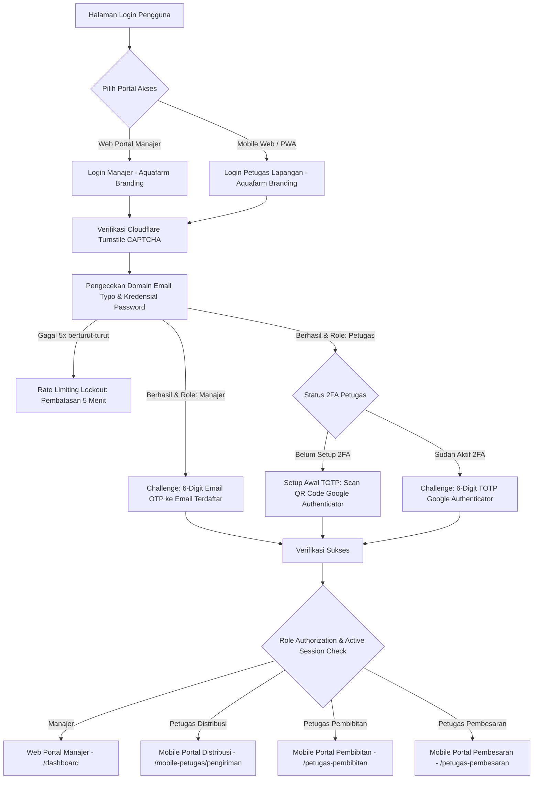

# Product Requirement Document (PRD)
# SIM-BUDIDAYA (Sistem Informasi Manajemen Budidaya Ikan Terpadu)
### *Aquafarm Aquaculture Management & Smart Supply Chain System*

---

## 1. Ringkasan Eksekutif (Executive Summary)
**SIM-BUDIDAYA** (*Aquafarm Management System*) adalah platform manajemen budidaya dan rantai pasok perikanan terpadu yang dirancang untuk mengotomatisasi, mengawasi, dan mengoptimalkan seluruh rantai operasional akuakultur—mulai dari proses pembenihan (*hatchery/pembibitan*), pembesaran (*grow-out*), tata kelola inventori & restok pakan, logistik armada distribusi pesanan berbasis geospatial, rekapitulasi margin laba rugi keuangan, hingga manajemen akun serta keamanan multi-role pengguna.

Sistem ini mengadopsi identitas merek resmi **Aquafarm** (`Logo aquafarm.png`) dan beroperasi dengan arsitektur dual-portal:
1. **Portal Web Manajer (Desktop-First / Responsive):** Digunakan oleh manajer operasional untuk pengawasan analitik KPI tambak, konfigurasi master data (ikan, kolam, mitra, pakan), kontrol rantai pasok, manajemen akun & reset keamanan petugas, pembukuan kas otomatis, serta ekspor laporan ke Excel. Dilengkapi header brand resmi Aquafarm pada sidebar navigasi.
2. **Portal Mobile Web / PWA Petugas (Mobile-First / PWA-Ready):** Digunakan oleh petugas lapangan (Petugas Distribusi, Petugas Pembibitan, dan Petugas Pembesaran) dengan antarmuka layar sentuh responsif, cepat, dan ringan untuk pencatatan aktivitas kolam harian, log pakan, dan penyelesaian surat jalan distribusi langsung dari perangkat genggam (*smartphone*). Dilengkapi splash screen dan form login dengan visual logo Aquafarm.

---

## 2. Identitas Merek & Desain Antarmuka (Brand Identity & Visual Assets)

| Komponen Aset | Implementasi & File Path | Penempatan Antarmuka |
|---|---|---|
| **Logo Resmi Perusahaan** | `public/build/images/Logo aquafarm.png` | Sidebar Desktop Manajer, Header Login Web Manajer, Splash Screen Mobile Petugas, Header Login Mobile Petugas, Formulir Lupa Password / Reset OTP, Email Notifikasi HTML OTP. |
| **Ilustrasi Login Portal** | `public/build/images/login ilustration.png` | Banner grafis visual sisi kanan pada desktop login manajer. |
| **Ikon Logistik & Distribusi** | `public/build/images/icon distribusi.png` & `icon siap kirim.png` | Modul distribusi pesanan, status surat jalan, dan mobile card pengiriman kurir. |
| **Logo Faktur & Invoice** | `public/build/images/logo sample di invoice.png` | Header bukti cetak invoice pesanan mitra distributor. |
| **Palet Warna Brand** | Primary Deep Navy (`#031B4E`, `#051B44`), Sky Blue Accent (`#0284C7`, `#38BDF8`), Soft Gray Background (`#F4F6F9`) | Keseluruhan antarmuka web portal & mobile PWA. |

---

## 3. Arsitektur Keamanan & Otentikasi (Security Architecture)

Sistem menerapkan prinsip *defense-in-depth* dengan perlindungan multi-lapis:

### 3.1 Lapisan Keamanan Inti
1. **Multi-Role Role-Based Access Control (RBAC):**
   - Dilindungi melalui `RoleMiddleware` dan enkapsulasi otorisasi rute.
   - Pemisahan 4 hak akses peran: `manajer`, `petugas_distribusi`, `pembibitan`, dan `pembesaran`.
2. **Dual-Strategy Two-Factor Authentication (2FA):**
   - **Role Manajer (Email OTP):** Kode OTP acak 6-digit dikirimkan langsung ke email manajer (`SendOtpMail`) dengan masa kedaluwarsa 5 menit, fitur kirim ulang berkala (*resend cooldown*), dan proteksi brute force. Dilengkapi header template email resmi Aquafarm.
   - **Role Petugas (Google Authenticator TOTP):** Standar Time-based One-Time Password via `Google2FA` dan `BaconQrCode`. Dilengkapi alur aktivasi QR Code `/2fa/setup`, form verifikasi login `/login/2fa`, serta fitur reset 2FA darurat oleh Manajer.
3. **Lupa Kata Sandi Terpadu (Forgot Password via Email OTP):**
   - Rute pemulihan kata sandi mandiri (`/forgot-password`) untuk semua role dengan alur verifikasi kode 6-digit OTP email dan token sesi aman bertema Aquafarm.
4. **Proteksi Bot dengan Cloudflare Turnstile CAPTCHA:**
   - Perlindungan anti-bot modern tanpa friksi interupsi pengguna pada seluruh form login (Site Key: `0x4AAAAAAEdjd7gXP6zJ1anD`).
5. **Pendeteksi Anomali & Typo Email (`EmailSecurityService`):**
   - Pengecekan otomatis salah ketik domain email populer (misal: `gmai.com`, `yaho.com`, `hotmial.com`), filter email sekali pakai (*disposable email*), dan validasi sintaks ketat RFC.
6. **Proteksi Brute-Force & Rate Limiting:**
   - Pembatasan maksimal 5 kali kegagalan input kredensial/CAPTCHA dengan sanksi penguncian akun selama 300 detik (5 menit) disertai *countdown timer* interaktif.
7. **Single Active Session (One-Session Policy):**
   - Menjamin integritas operasional di mana satu akun hanya dapat login aktif pada satu browser/perangkat dalam satu waktu.
8. **Pengelolaan Profil & Avatar Pengguna (`foto_profil`):**
   - Unggah foto profil pengguna ke *storage* dengan validasi tipe berkas dan ukuran (maks 2MB), penghapusan foto usang otomatis, dan fallback avatar dinamis.

---

## 4. Matriks Menu & Alur Pengguna (Feature Breakdown)

### 4.1 Alur Autentikasi & Keamanan (Auth Routes)

| Rute / Endpoint | Aktor | Deskripsi Fungsionalitas & Branding |
|---|---|---|
| `/login` | Manajer | Form login web desktop berlogo Aquafarm: input Email/Username, Kata Sandi, Cloudflare Turnstile CAPTCHA, Remember Me. |
| `/login/otp` | Manajer | Form input 6-digit Email OTP yang dikirim ke email manajer saat login berhasil. |
| `/mobile-petugas/login` | Petugas Lapangan | Form login mobile PWA berlogo Aquafarm: pemilih tab role (`Distribusi`, `Pembesaran`, `Pembibitan`), input Email/No HP, Kata Sandi, dan Turnstile CAPTCHA. |
| `/2fa/setup` | Petugas Baru | Halaman setup awal Google Authenticator: Tampilan QR Code dan secret key untuk dipindai di aplikasi autentikator. |
| `/login/2fa` | Petugas Aktif | Form verifikasi 6-digit TOTP Google Authenticator setelah password lolos. |
| `/forgot-password` | Semua Role | Permintaan link/kode reset password via email terdaftar dengan logo Aquafarm. |
| `/forgot-password/verify` | Semua Role | Verifikasi kode OTP 6-digit pemulihan kata sandi. |
| `/forgot-password/reset` | Semua Role | Form penetapan kata sandi baru. |
| `/logout` & `/mobile-petugas/logout` | Semua Role | Terminasi sesi, pembersihan token autentikasi, dan pengalihan ke halaman masuk. |

---

### 4.2 Portal Web Manajer (Desktop-First / Responsive Web)

#### 1. Dashboard Eksekutif (`/dashboard`)
- **Header & Sidebar Branding:** Integrasi logo Aquafarm dan penamaan *SIM-BUDIDAYA Aquafarm Management*.
- **Kartu Metrik KPI Real-Time:** Total biomassa ikan siap panen (kg), rata-rata FCR tambak, target panen berjalan (kg), total konsumsi pakan, rata-rata kualitas pH air, dan status batch aktif.
- **Grafik Finansial & Produksi Terintegrasi:** Visualisasi grafik bulanan perbandingan arus kas pemasukan vs pengeluaran dan tren pertumbuhan biomassa kolam.
- **Tabel Monitoring Batch Berjalan:** Ringkasan status kolam, jenis komoditas, usia tebar (DOC), dan estimasi berat.
- **Ekspor Laporan ke Excel (`/dashboard/export-excel`):** Unduh rekapitulasi data operasional tambak dan KPI secara instan dalam format `.xlsx`.

#### 2. Manajemen Batch Pembibitan (`/pembibitan`)
- **Pencatatan Siklus Hatchery:** Input kode batch, pemilihan kolam penetasan, jenis ikan, tanggal mulai pemijahan, perkiraan tanggal panen benih, jumlah telur/larva, dan catatan teknis.
- **Monitoring Mortalitas & Benih Hidup:** Kalkulasi tingkat kelangsungan hidup (*Survival Rate*) larva benih.
- **Fitur Transfer Benih ke Kolam Pembesaran (`/pembibitan/{id}/transfer`):** Mengonversi benih siap tebar langsung menjadi batch pembesaran baru di kolam tujuan serta memperbarui status batch pembibitan menjadi selesai/panen.
- **Filter & Aksi CRUD:** Tambah, perbarui data mortalitas, penyesuaian tanggal sortir, dan hapus batch.

#### 3. Master Data Jenis Ikan (`/ikan`)
- **Katalog Spesies Budidaya:** Manajemen data komoditas ikan (misal: Nila Merah, Nila Hitam, Lele Sangkuriang, Gurame Soang, Patin Siam).
- **Konfigurasi Standar Siklus:** Parameter durasi hari masa penetasan dan durasi hari masa pembibitan untuk kalkulasi otomatis estimasi panen.
- **Pemetaan Batch Terkait:** Menampilkan batch pembibitan yang sedang memanfaatkan jenis ikan bersangkutan.

#### 4. Manajemen Batch Pembesaran (`/pembesaran`)
- **Pelacakan Siklus Pembesaran (Grow-out):** Input batch kolam, tanggal tebar bibit, jumlah tebar (ekor), berat awal per ekor (gram), estimasi biomassa total (kg), dan target panen.
- **Kalkulasi Metrik Otomatis:** Perhitungan otomatis *Day of Culture (DOC)* harian, rata-rata bobot ikan (*Average Body Weight / ABW*), estimasi biomassa kolam, dan rasio konversi pakan (*Feed Conversion Ratio / FCR*).
- **Manajemen Panen:** Pencatatan status panen parsial, panen total, jumlah berat riil panen (kg), tanggal panen aktual, dan catatan mortalitas.
- **Shortcut Tambah Kolam Cepat:** Modal pembuatan master kolam baru tanpa meninggalkan halaman pembesaran.

#### 5. Monitoring Kolam & Pembudidaya (`/pembudidaya`)
- **Inventaris Master Kolam:** Data seluruh kolam budidaya mencakup nama/kode kolam, tipe konstruksi (Kolam Terpal, Kolam Beton, Kolam Tanah, Sistem Bioflok), dimensi panjang x lebar x tinggi, volume air (m³), dan lokasi/blok tambak Aquafarm.
- **Status Operasional Kolam:** Indikator visual ketersediaan kolam (*Tersedia, Terisi/Aktif, Masa Pengeringan/Persiapan, Masa Sterilisasi/Perawatan*).
- **Monitoring Parameter Kualitas Air:** Log pemantauan suhu (°C), derajat keasaman (pH), dan oksigen terlarut (*Dissolved Oxygen / DO*).

#### 6. Log Stok & Manajemen Pakan Terpadu (`/log-pakan`)
- **Inventori Master Stok Pakan (`StokPakan`):**
  - Katalog varian pakan (kode pakan, merk/nama pelet, tipe pakan: Pelet Apung, Pelet Tenggelam, Pakan Alami/Cacing Sutra, Tepung Mikro).
  - Peruntukan fase (*Pembibitan*, *Pembesaran*, *Semua*), satuan (kg/karung), batas minimum stok (*threshold*), dan harga satuan.
  - **Analisis Burn Rate & Proyeksi Sisa Hari:** Algoritma kalkulasi konsumsi 7 hari terakhir untuk menentukan proyeksi sisa hari stok habis dengan indikator status otomatis (*Kritis - Segera Restock*, *Waspada - Perlu Pesan*, *Aman*).
- **Pengadaan & Restok Pakan Supplier (`PembelianPakan`):**
  - Form input pembelian pakan masuk dari mitra supplier (pilihan supplier, jumlah kg/karung, harga total faktur, nomor nota, tanggal pembelian).
  - **Otomatisasi Lintas Modul:** Penambahan saldo stok pakan secara otomatis sekaligus pencatatan otomatis transaksi pengeluaran di buku kas Keuangan.
  - **Pemesanan Cepat via WhatsApp:** Integrasi tombol order ke kontak WhatsApp supplier terpilih dengan draft pesan pesanan otomatis.
- **Log Konsumsi Pakan Harian Kolam (`ManajemenPakan`):**
  - Pencatatan pemberian pakan harian (pagi/sore) per kolam/batch dengan pengurangan saldo stok pakan secara *real-time*.

#### 7. Distribusi & Pesanan Logistik (`/distribusi`)
- **Manajemen Surat Jalan & Tiket Pengiriman:** Pembuatan order penjualan ikan (nomor DO `#ORD-YYYY-XXXX`, mitra pemesan, batch kolam asal, total kg, harga total, tanggal pengiriman, penugasan kurir/driver, armada, dan status order: *Pending, Pemberokian/Proses, Dalam Pengiriman, Selesai, Dibatalkan*).
- **Peta Geospatial Interaktif Distribusi (Leaflet.js + OpenStreetMap):**
  - Peta digital GIS interaktif menampilkan sebaran titik koordinat (*latitude/longitude*) seluruh mitra distributor toko/pasar.
  - *Pin marker* interaktif dengan pop-up rute pengiriman, status pesanan aktif, dan informasi kontak mitra.

#### 8. Rekapitulasi & Laporan Keuangan (`/keuangan` & `/keuangan/transaksi`)
- **Buku Kas Arus Kas Masuk & Keluar:** Pencatatan omzet penjualan ikan/bibit (Inflow) dan biaya operasional belanja pakan, bibit, vitamin, listrik, BBM armada, serta perawatan kolam (Outflow).
- **Penomoran Referensi Transaksi Otomatis (SOP ID):** Format standar akuntansi unik berbasis tanggal (`TRX-YYMM-XXX`).
- **Skor Kesehatan Keuangan (Financial Health Score):** Metrik kalkulasi rasio margin keuntungan bersih terhadap beban operasional dengan status kesehatan kas (*Stable & Sehat* vs *Perlu Evaluasi*).
- **Analisis Laba Bersih & Arus Kas Bulanan:** Ringkasan total pendapatan, total beban, laba bersih, dan grafik tren arus kas per bulan sepanjang tahun berjalan.
- **Filter & Export Transaksi:** Penyaringan berdasarkan rentang tanggal, kategori, atau tipe transaksi.

#### 9. Manajemen Mitra Distributor & Supplier (`/mitra`)
- **Database Mitra Komprehensif:** Pengelolaan profil pembeli (Pasar Tradisional, Restoran/Hotel, Agen Grosir, Eksportir) serta Supplier Pakan/Bahan Baku.
- **Integrasi Koordinat Geografis GIS:** Input titik koordinat Latitude dan Longitude dengan bantuan visual peta untuk penentuan rute kurir.
- **Histori Transaksi Mitra:** Arsip volume order (kg), riwayat pengiriman, dan kontak telepon/WhatsApp langsung.

#### 10. Manajemen Akun Petugas & Keamanan Akses (`/petugas`)
- **Kelola Data Karyawan:** Tambah akun petugas baru, perbarui identitas/nomor telepon, aktivasi/nonaktifkan akun, dan pemilihan role teknis (*Petugas Distribusi*, *Petugas Pembibitan*, *Petugas Pembesaran*).
- **Manajemen Kredensial & Reset Password:** Pembaruan kata sandi akun petugas oleh manajer saat dibutuhkan.
- **Fitur Reset 2FA Petugas (`/petugas/{id}/reset-2fa`):** Manajer memiliki wewenang mereset *secret key* Google Authenticator jika petugas lapangan kehilangan gawai atau aplikasi autentikator terhapus.

#### 11. Pengaturan Sistem & Profil Manajer (`/pengaturan`)
- **Profil Manajer & Keamanan:** Pengubahan nama, email, nomor kontak, kata sandi, serta unggah dan ganti foto profil avatar.
- **Preferensi Operasional Tambak:** Konfigurasi nama tambak/perusahaan (*SIM-BUDIDAYA Aquafarm*), ambang batas mortalitas kritis, target FCR standar, satuan berat, dan preferensi notifikasi.

---

### 4.3 Portal Mobile Web / PWA Petugas (Mobile-First Experience)

Antarmuka mobile dirancang khusus untuk kenyamanan operasional teknisi lapangan dengan navigasi cepat, tata letak sentuh (*touch-friendly*), dan optimasi visual logo Aquafarm:

```mermaid
flowchart TD
    subgraph Petugas Distribusi
        D1[Splash Screen Aquafarm /mobile-petugas/splash] --> D2[Daftar Tugas Pengiriman Hari Ini]
        D2 --> D3[Detail Surat Jalan & Penunjuk Arah Peta]
        D3 --> D4[Konfirmasi Selesai & Upload Bukti Serah Terima]
        D4 --> D5[Riwayat Pengiriman & Profil Akun]
    end

    subgraph Petugas Pembibitan
        B1[Splash Screen Aquafarm /petugas-pembibitan/splash] --> B2[Dashboard Batch Benih Aktif]
        B2 --> B3[Form Input Pemijahan Benih Baru]
        B3 --> B4[Log Pemberian Pakan Benih Harian]
        B4 --> B5[Profil Petugas & Update Avatar]
    end

    subgraph Petugas Pembesaran
        P1[Splash Screen Aquafarm /petugas-pembesaran/splash] --> P2[Dashboard Kolam Pembesaran & DOC]
        P2 --> P3[Form Buat Batch Tebar Benih Baru]
        P3 --> P4[Log Pakan Harian & Sampling Bobot]
        P4 --> P5[Profil Petugas & Update Avatar]
    end
```

#### A. Petugas Distribusi (Logistik & Armada Pengiriman)
- **Splash Screen (`/mobile-petugas/splash`):** Animasi pembuka dengan Logo Aquafarm transisi halus.
- **Daftar Tugas Pengiriman (`/mobile-petugas/pengiriman`):**
  - Kartu ringkasan surat jalan penugasan hari ini: nama toko/mitra, nomor order, jenis ikan, bobot (kg), dan status pengiriman.
- **Detail Pengiriman & Navigasi Rute (`/mobile-petugas/detail/{id}`):**
  - Alamat lengkap tujuan, tautan navigasi langsung ke Google Maps / Waze, dan rincian harga.
  - **Aksi Penyelesaian Pengiriman (`/mobile-petugas/complete/{id}`):** Konfirmasi barang sampai, penginputan catatan serah terima, dan upload foto bukti tanda terima fisik.
- **Riwayat Pengantaran (`/mobile-petugas/riwayat`):** Arsip seluruh surat jalan yang telah diselesaikan beserta timestamp waktu kirim.
- **Profil & Akun Kurir (`/mobile-petugas/akun`):** Pengaturan identitas petugas, upload/ganti foto profil, informasi status 2FA, dan tombol logout.

#### B. Petugas Pembibitan (Hatchery / Benih Ikan)
- **Splash Screen (`/petugas-pembibitan/splash`):** Layar pembuka portal pembibitan berlogo Aquafarm.
- **Dashboard Pembibitan (`/petugas-pembibitan`):** Ringkasan total batch benih aktif, total estimasi bibit hidup, dan indikator batch siap sortir/tebar.
- **Form Input Batch Pemijahan (`/petugas-pembibitan/form`):** Form cepat input batch pemijahan baru (pemilihan jenis ikan, nomor kolam penetasan, jumlah indukan/telur, tanggal pemijahan, dan estimasi larva hidup).
- **Log Pakan Benih Harian (`/petugas-pembibitan/log-pakan`):** Form pencatatan pemberian pakan harian benih (cacing sutra/pelet mikro) yang langsung terhubung dan memotong stok inventori pakan pembibitan.
- **Profil & Akun Teknisi (`/petugas-pembibitan/akun`):** Pengaturan profil mandiri, nomor kontak, dan ganti foto profil.

#### C. Petugas Pembesaran (Teknisi Kolam Pembesaran)
- **Splash Screen (`/petugas-pembesaran/splash`):** Layar pembuka portal pembesaran berlogo Aquafarm.
- **Dashboard Kolam Pembesaran (`/petugas-pembesaran`):** Monitoring status seluruh kolam pembesaran, penghitungan usia budidaya (*Day of Culture / DOC*), dan estimasi jadwal panen.
- **Form Tebar Benih Baru (`/petugas-pembesaran/create-batch`):** Input penaburan bibit baru ke kolam (pilihan kolam, jenis komoditas ikan, jumlah tebar ekor bibit, berat awal tebar, dan target panen).
- **Log Pakan & Sampling Bobot (`/petugas-pembesaran/log-pakan`):**
  - Input pemberian pakan harian kolam (pagi & sore dalam kg) dengan auto-deduct inventori stok.
  - Input hasil sampling berat rata-rata ikan (gram/ekor) dan catatan kualitas air untuk memperbarui estimasi biomassa kolam.
- **Profil & Akun Teknisi (`/petugas-pembesaran/akun`):** Pengaturan data diri teknisi dan ganti foto profil avatar.

---

## 5. Spesifikasi Teknologi (Technology Stack)

| Komponen | Spesifikasi & Library yang Digunakan |
|---|---|
| **Backend Framework** | Laravel 11 / 12 / 13 (PHP 8.2+) |
| **Basis Data** | MySQL / MariaDB (Relational Schema dengan Foreign Keys & Indexing) |
| **Frontend Web & UI** | Blade Templating, Tailwind CSS, Alpine.js, Lucide Icons / Heroicons |
| **Peta & Geospatial (GIS)** | Leaflet.js, OpenStreetMap Tile API |
| **Keamanan & Anti-Bot** | Cloudflare Turnstile CAPTCHA (Site Key: `0x4AAAAAAEdjd7gXP6zJ1anD`) |
| **Otentikasi 2FA (TOTP)** | `pragmarx/google2fa-laravel`, `bacon/bacon-qr-code` |
| **Otentikasi Email OTP** | Laravel Mailables (`SendOtpMail`), SMTP Integration |
| **Email Security Service** | `EmailSecurityService` (Validasi domain typo, format RFC, disposable check) |
| **Manajemen Berkas & Foto** | Laravel Storage System (`storage/app/public/profil`) |
| **Ekspor Data** | Excel / CSV Spreadsheet Generator (`/dashboard/export-excel`) |
| **Asset Logo & Branding** | `Logo aquafarm.png`, `login ilustration.png`, `icon distribusi.png` |
| **Format Mobile & PWA** | Mobile-First Touch UI, Responsive Viewport, Web Manifest Ready |
| **Asset Bundler** | Vite 5+, PostCSS, NPM |

---

## 6. Non-Functional Requirements (NFR)

1. **Responsivitas & Adaptabilitas Perangkat:**
   - **Portal Manajer:** Dioptimalkan untuk tata letak desktop & tablet (resolusi 1024px ke atas) dengan sidebar navigasi berlogo Aquafarm, tabel data interaktif, dan grafik visual.
   - **Portal Petugas Lapangan:** Didesain dengan filosofi *Mobile-First* untuk rentang layar 360px – 480px dengan tombol sentuh berukuran ergonomis (*touch target* minimal 44x44px), form sederhana, dan navigasi tab bawah (*bottom bar*).
2. **Kinerja & Kecepatan Akses (Performance):**
   - Kecepatan pemuatan halaman di bawah 1.5 detik pada jaringan seluler 4G/Wi-Fi standar melalui optimasi bundling aset termonifikasi via Vite.
   - Efisiensi kueri database dengan *Eager Loading* (`with(['kolam', 'user', 'mitra'])`) untuk mencegah isu *N+1 query*.
3. **Integritas & Keandalan Data (Data Integrity):**
   - Transaksi keuangan dan penyesuaian stok pakan dibungkus dalam *Database Transactions* (`DB::transaction`) guna menjamin konsistensi ACID (*Atomicity, Consistency, Isolation, Durability*).
   - Validasi ketat di sisi server untuk mencegah nilai negatif pada stok pakan, biomassa kolam, maupun nominal kas.
   - **Batasan Ambang Input (*Input Threshold Guard*):**
     - **Jumlah Pembelian Pakan Baru:** Dibatasi minimal `0.1` dan maksimal `1.000` (kg / satuan) per transaksi.
     - **Log Pemberian Pakan Harian:** Dibatasi minimal `0` dan maksimal `100` kg per sesi pemberian pakan.
     - **Nominal Harga & Biaya (Rupiah):** Tidak dibatasi nilai maksimumnya (*unrestricted*, $\ge 0$).
4. **Ketersediaan & Pemulihan Keamanan (Resilience):**
   - Kebijakan *Single Active Session* untuk mencegah penggunaan akun bersama secara ilegal.
   - Manajer memiliki mekanisme darurat untuk mereset 2FA petugas jika terjadi kehilangan perangkat.
